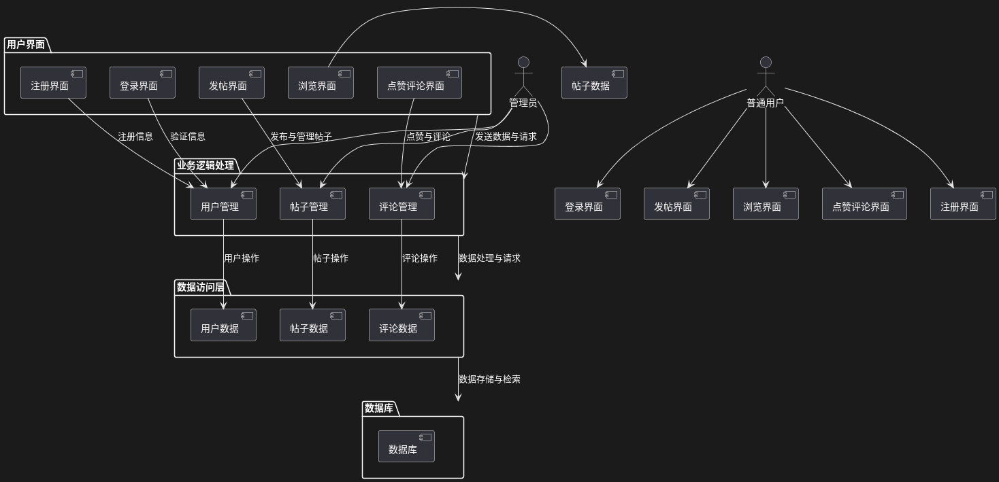
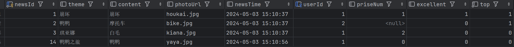

# bronya_forum

[](https://opensource.org/licenses/MIT)

**A modern and robust forum system built with Java, designed for professional and focused community discussions.**


## Introduction

`bronya_forum` is a forum application designed to provide a dedicated space for in-depth discussions within a specialized community. Unlike general social media platforms, `bronya_forum` focuses on offering a structured and controlled environment where users can engage in meaningful conversations, share knowledge, and contribute to a focused topic.

While platforms like Facebook, Twitter, and Reddit offer broad social interactions, `bronya_forum` addresses the need for specialized discussion spaces. It takes inspiration from the success of platforms like Stack Overflow, which cater to specific professional communities. This project not only serves as a practical application but also functions as an educational tool for the developer, fostering learning in web development, database design, network security, and complex user interaction management.

## Core Features

This forum system offers a comprehensive set of features, categorized by user roles:

### Common User Features

*   **Registration & Login:**
    *   Secure user registration with username, password, and verification code.
    *   Secure login with username, password, and verification code.
*   **Thread Browsing:**
    *   View lists of forum threads, including options for sorting and filtering.
    *   Ability to view pinned threads.
*   **Thread Posting:**
    *   Create new threads with a title and detailed content.
*   **Commenting & Replies:**
    *   Comment on threads.
    *   Reply to existing comments.
*   **Like/Unlike:**
    *   Like threads and comments.
    *   Cancel likes on threads and comments.
*   **User Profile Management:**
    *   Upload and change profile pictures.
    *   Change personal information like password and email address.

### Administrator Features

*   **Thread Management:**
    *   Delete threads that violate forum guidelines.
    *   Pin high-quality threads.
    *   Unpin threads.
*   **User Management:**
    *   Delete user accounts that violate forum guidelines.
    *   Modify user details (e.g., username, password).
*   **Comment Management:**
    *   Delete comments that violate forum guidelines.
*   **Admin Dashboard:**
    *   Access a dashboard with forum statistics, user activities, and thread status.

## Technology Stack

*   **Frontend:** React.js
*   **Backend:** Spring Boot (Java)
*   **Database:**  MySQL
*   **Version Control:** Git
*   **CI/CD:** Jenkins 

## System Architecture



The system follows a clear modular structure:

*   **Frontend Module:** Responsible for user interface rendering, user interaction, and data presentation. Built with React.js.
*   **Backend Module:** Handles business logic, data validation, and database interaction. Developed using Spring Boot.
*   **Database:**  MySQL Used for data persistence and retrieval.

## Database Design

## Getting Started

To get started with the project, please follow these steps:

1.  **Clone the Repository:**

    ```bash
    git clone https://github.com/biluoliuqin/bronya_forum.git
    ```

1.  **Backend Start:**
    *   Make sure to setup your database and connection according to your configuration.
    *   start the server.

2.  **Access the Application:**
    *   Open a web browser and go to `http://localhost:8080/Forum_war_exploded` to access the forum.

## Contributing

Contributions to `bronya_forum` are welcome! Please feel free to submit pull requests, report bugs, or suggest enhancements.

## License

`bronya_forum` is licensed under the [MIT License](https://opensource.org/licenses/MIT).
